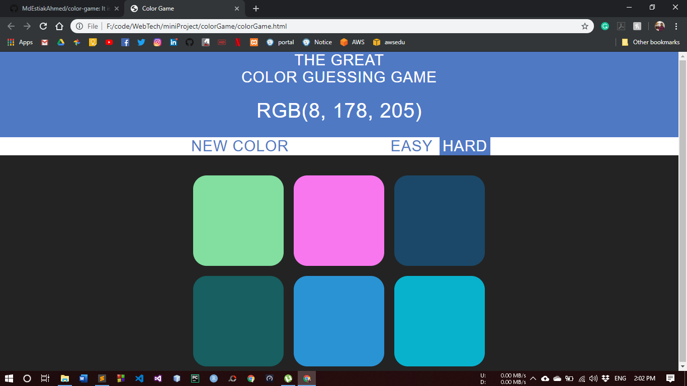

<!DOCTYPE html>
<html>
	<head>
	</head>
	<body>
    <h1>color-game</h1>
    
It is a simple web based game programmed with JavaScript.

		<h3>how to play:</h3>
		<ul>
			<li>open "colorGame.html"</li>
			<li>according to rgb code (given in the game) guess the color and select.</li>
			<li>you can changed color by clicking "new color" button.</li>
			<li>you can set game mode (easy or hard)</li>
		</ul>
		<h2>game screen shots:</h2>
		
	</body>
</html>
